# 프로젝트 개요

<table>
  <tr>
    <td>
      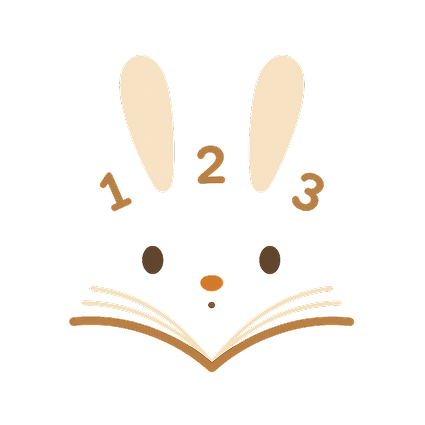
    </td>
    <td>
      <b style="font-size: 22px;">수나무</b> 
      
수학을 키우는 작은 씨앗 한 걸음씩 수학의 숲으로!

    </td>
  </tr>
</table>

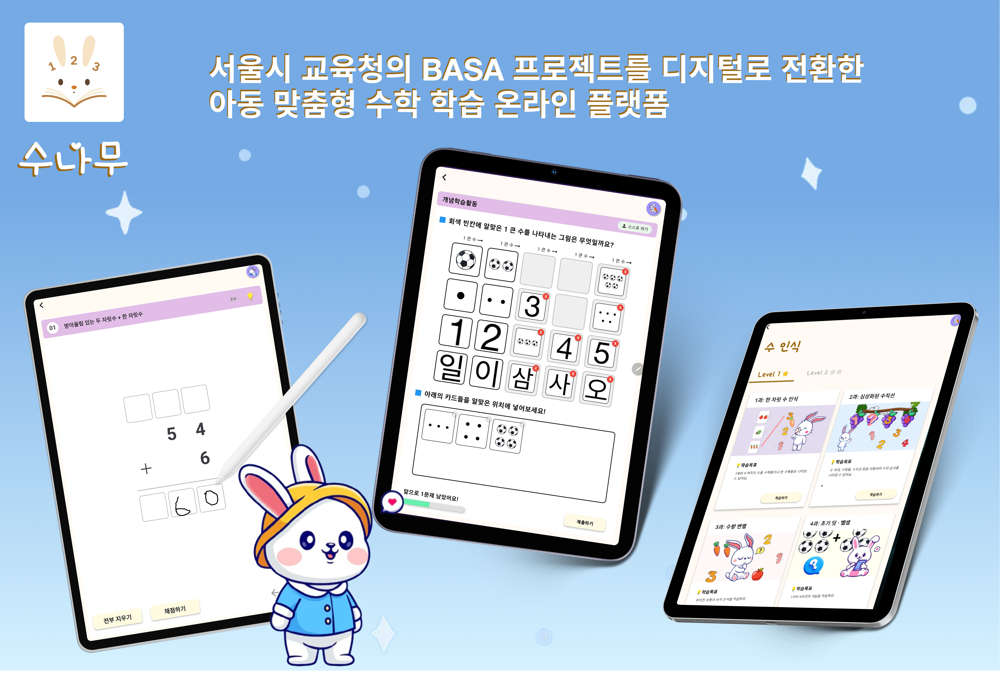

<!-- 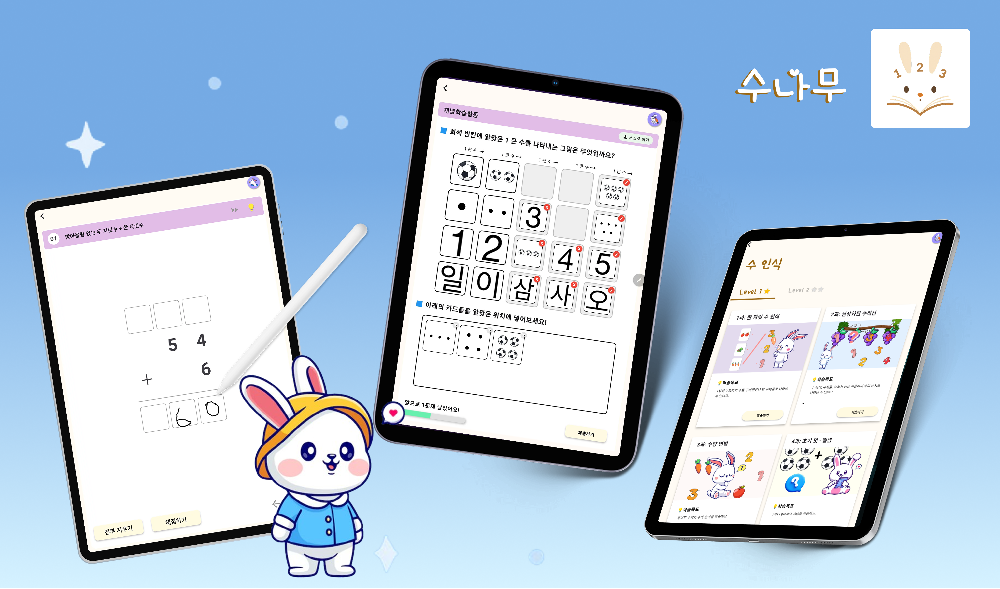 -->

 

## 목차

1. [서비스 소개](#서비스-소개)
2. [서비스 목표](#서비스-목표)
3. [프로젝트 기간](#프로젝트-기간)
4. [팀원 소개](#팀원-소개)
5. [프로젝트 설계 및 구성](#프로젝트-설계-및-구성)  
   5-1. [서비스 아키텍처](#서비스-아키텍처)  
   5-2. [데이터베이스 설계](#데이터베이스)  
   5-3. [사용 기술](#사용-기술)
6. [주요 기능](#주요-기능)  

 

# 서비스 소개

 본 프로젝트는 수학 학습에 어려움을 겪는 아동, 일명 “난산증” 아동을 위한 맞춤형 수학교육 솔루션입니다.
 서울시 교육청은 이러한 아동을 조기에 발견하고 지원하기 위해 **‘BASA 프로그램’**을 도입하였습니다.
 저희 팀은 BASA 프로그램의 기획자이신 교수님과 협업하여, 난산증 증상 개선에 실효성 있는 솔루션을 제공하고자 합니다.

 

# 서비스 목표

- 공동 특허 출원을 통해 기술적 차별성과 우위를 확보

- 교육청 및 공공기관과의 연계 확장을 통한 플랫폼 제공

- 연구 기반의 정교한 분석 기법과 맞춤형 중재 솔루션을 온라인 플랫폼에 구현

- BASA 온라인 솔루션의 유효성 검증

- 기존 BASA 참여 교사의 사용성 피드백과 요구사항 반영을 통해 사용자 친화적 개선 지속

- 초등학교, 특수교육기관, 정부 기관과의 협업을 확대하여 사회적 가치 창출 실현

 

# 프로젝트 기간

### 2025.03.04 ~ 2025.04.11

 

#  팀원 소개

<table align="center">
  <tr>
    <td align="center" width="17%;">
      
       <b>전성호</b> 
      팀장 
      BE
      
    </td>
    <td align="center" width="17%;">
      
       <b>오지원</b> 
      BE
      
    </td>
    <td align="center" width="17%;">
      
       <b>김성조</b> 
      Infra/BE
      
    </td>
    <td align="center" width="17%;">
      
       <b>조건희</b> 
      FE
      
    </td>
    <td align="center" width="17%;">
      
       <b>이수호</b> 
      FE
      
    </td>
    <td align="center" width="17%;">
      
       <b>박해구</b> 
        FE
      
    </td>
  </tr>
</table>

 

# 프로젝트 설계 및 구성

## 서비스 아키텍처

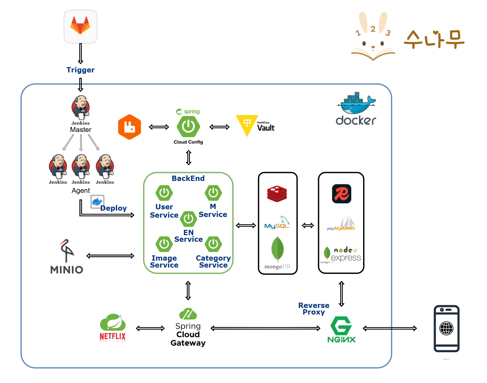

## 데이터베이스

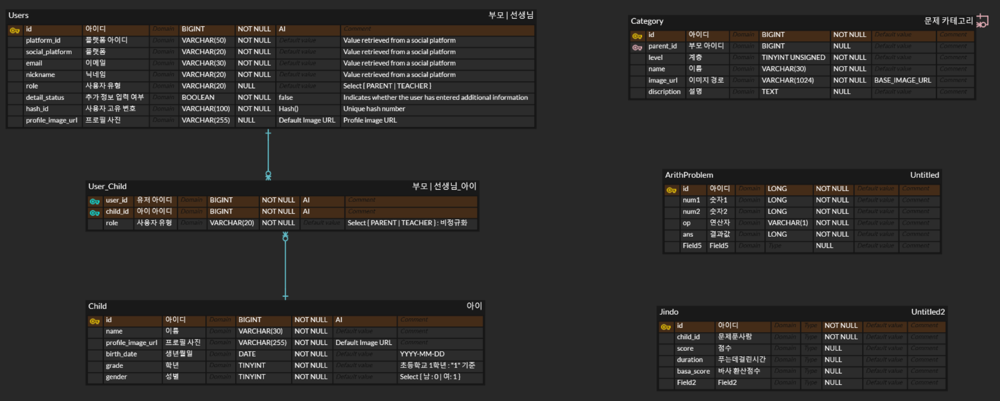

 

## 사용 기술

### 운영체제
---
- **로컬 개발 환경:** 
  
  
- **서버 운영 환경:**

  
  

### IDE & Editor
---
  
  
  

### 버전 & 이슈 관리 및 협업 도구
---
  
  
  
  

### 배포 환경 및 빌드 도구
---
  
  
  
  
  

  - AWS EC2 (Ubuntu `22.04`)
  - Nginx `1.18.0`
  - Docker `28.0.1`
  - Jenkins (CI/CD) `2.501`
  - Gradle `8.11.1`

### BackEnd
---
  
  
  

  
  
  

- JAVA (OpenJDK `17.0.14`)
- SpringBoot `3.4.1`
- Spring Cloud Gateway `4.1.0`
- Spring Cloud Eureka `4.0.3`
- Spring Cloud Config `4.1.0`

### FrontEnd
---
  
  

- Flutter `3.29.0`
- Dart `3.7.0`

### DB & Storage
---

- Vault `1.19.0`
- MySQL `8.0.4`
- MongoDB `7.0.17`
- Redis `7.4.2`
- Minio `RELEASE.2025-03-12T18-04-18Z`
- RabbitMQ `4.1.0`

 

# 주요 기능
## 로그인/회원가입
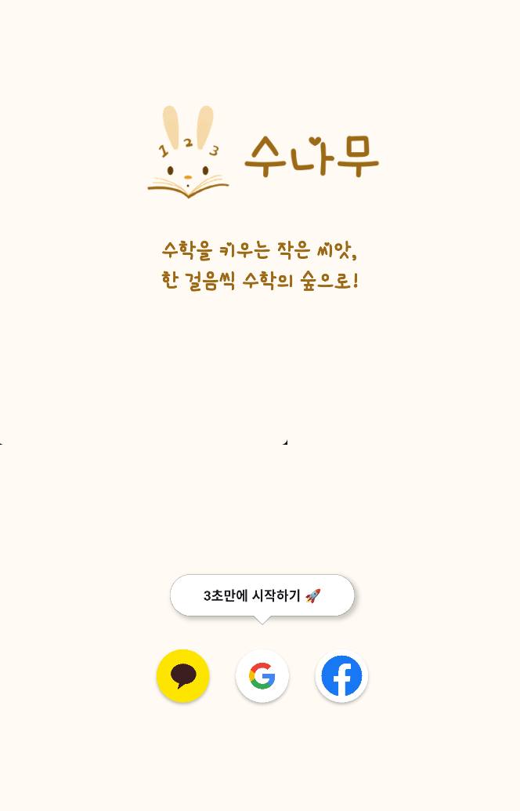
<!--  -->

## 아이 프로필 생성 및 선택
| 아이 정보 입력 | 프로필 선택 |
|---|---|
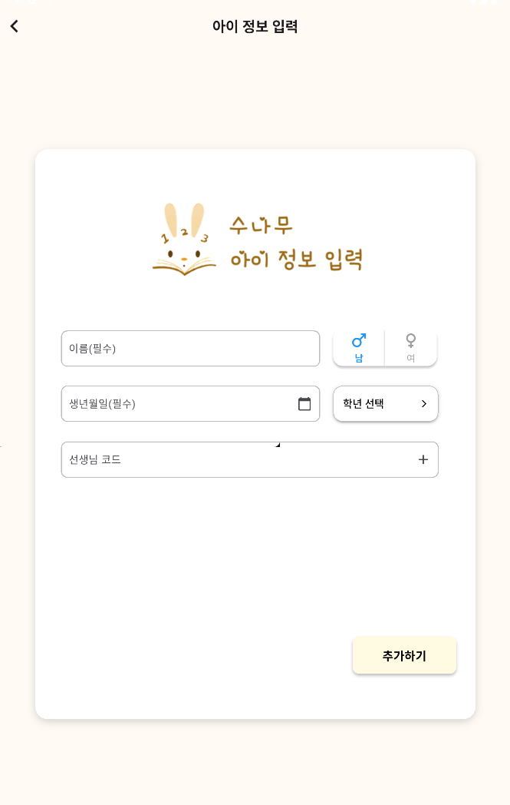 | 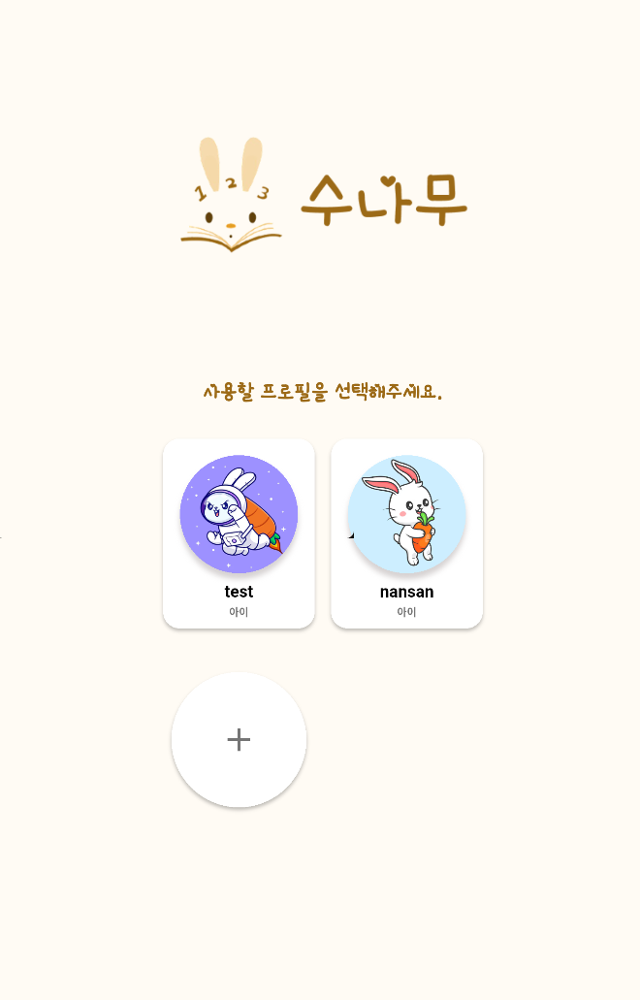

## 학습 시작하기
수 인식, 혹은 사칙연산 카드를 클릭하여 학습할 내용 선택

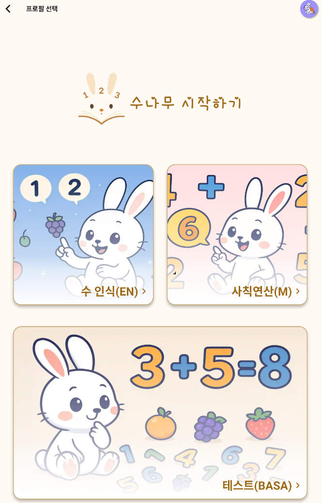

### 수 인식(EN) 학습 시작하기
- **레벨 별 과(1 ~ 4과) 선택 및 학습할 차시 선택**
  | 레벨 및 과 선택 | 차시 선택 |
  |---|---|
  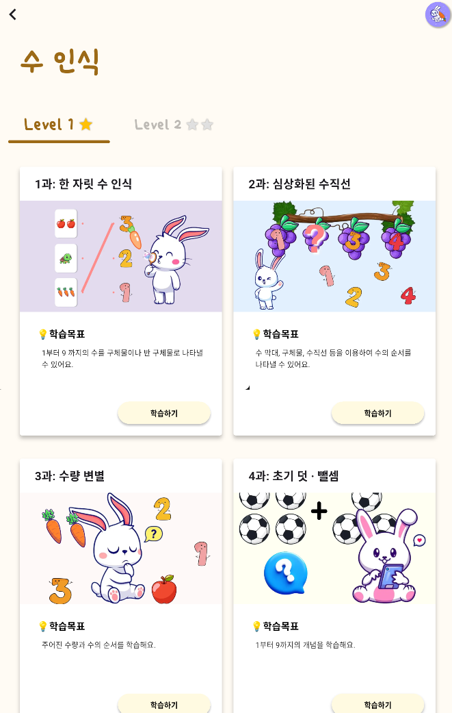 | 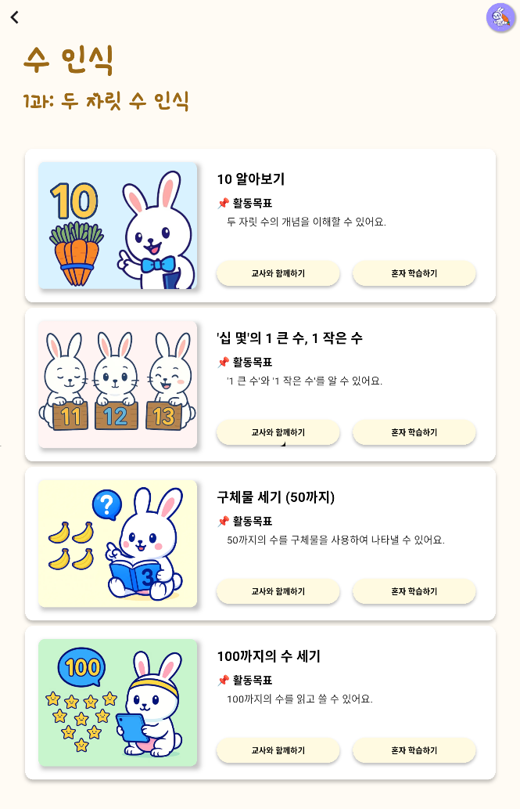

- **수 인식(EN) 문제 유형**

  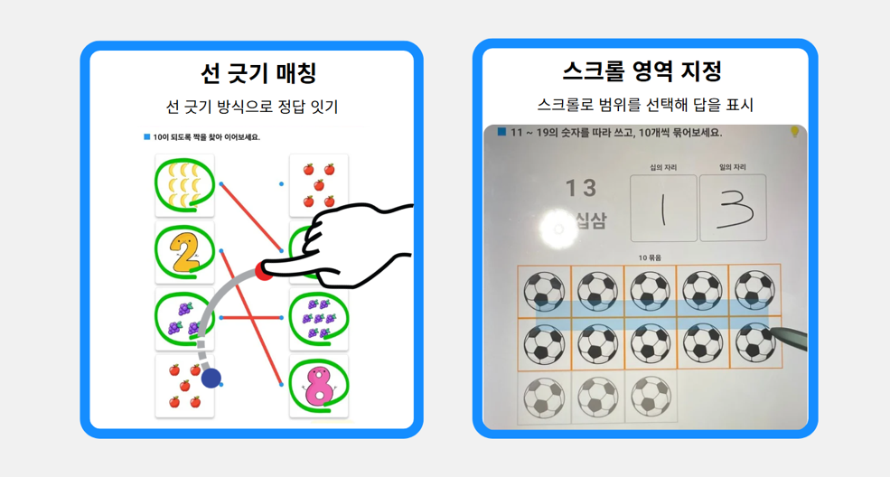

  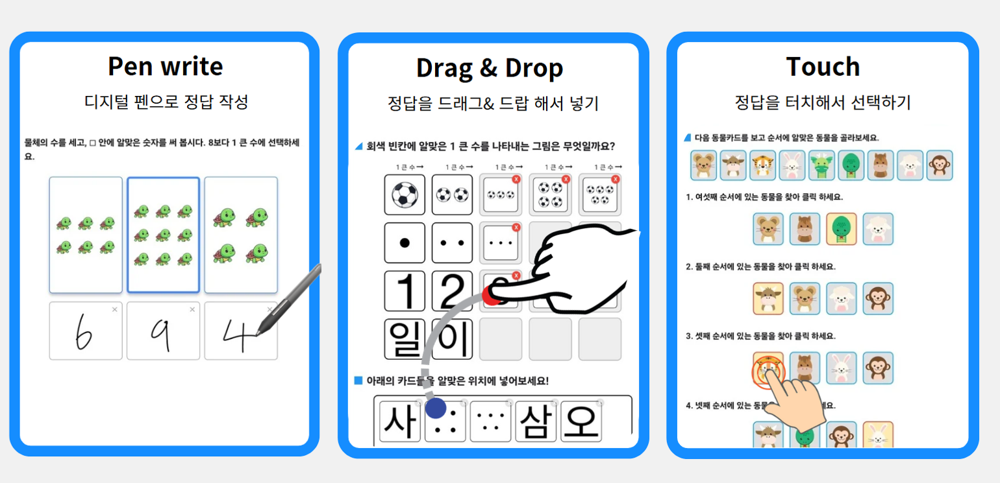

### 사칙연산(M) 학습 시작하기
- **과(1 ~ 6과) 선택 및 학습할 유형 선택**
  | 과 선택 | 유형 선택 |
  |---|---|
  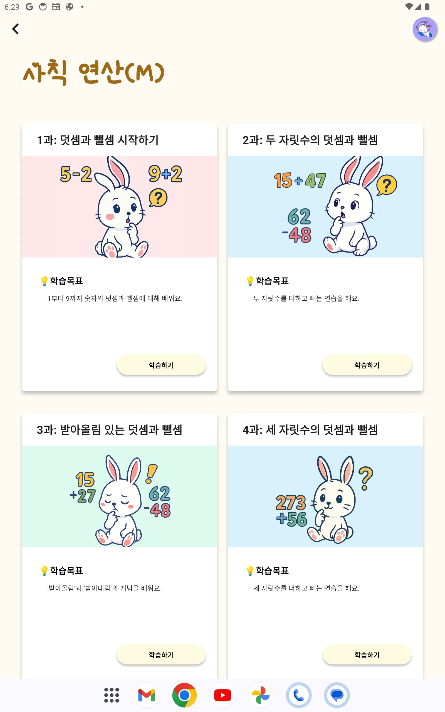 | 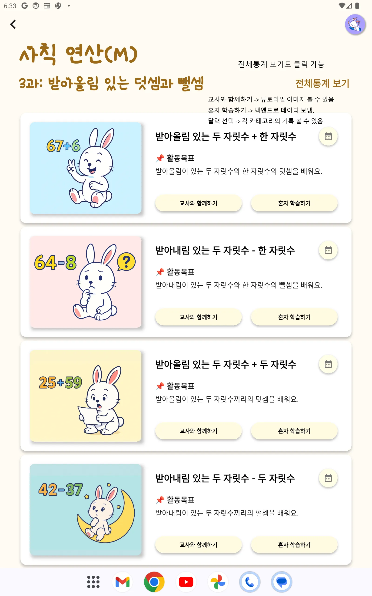

- **문제 풀이**

  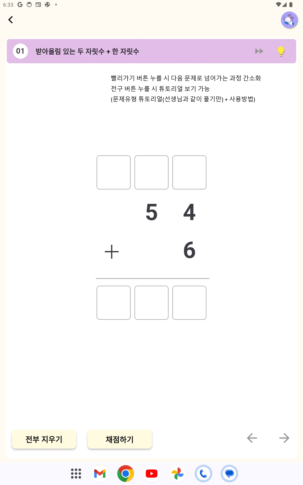 | 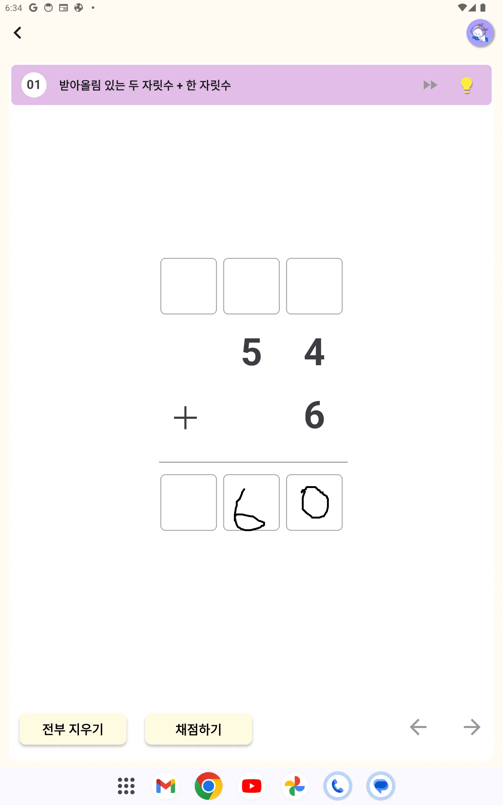
  |---|---|

- **통계**
  | 날짜 별 문제 풀이 목록 | 문제 오답 유형 및 원인 확인 | 카테고리 전체 문제 풀이 통계 |
  |---|---|---|
  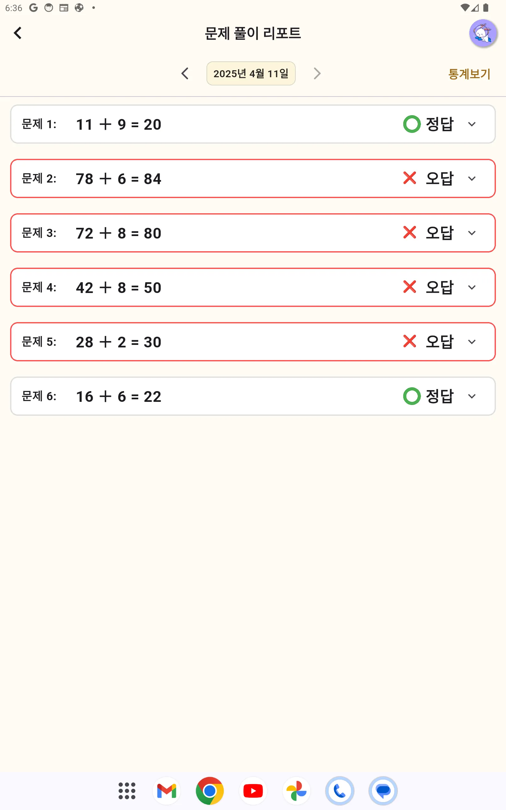 | 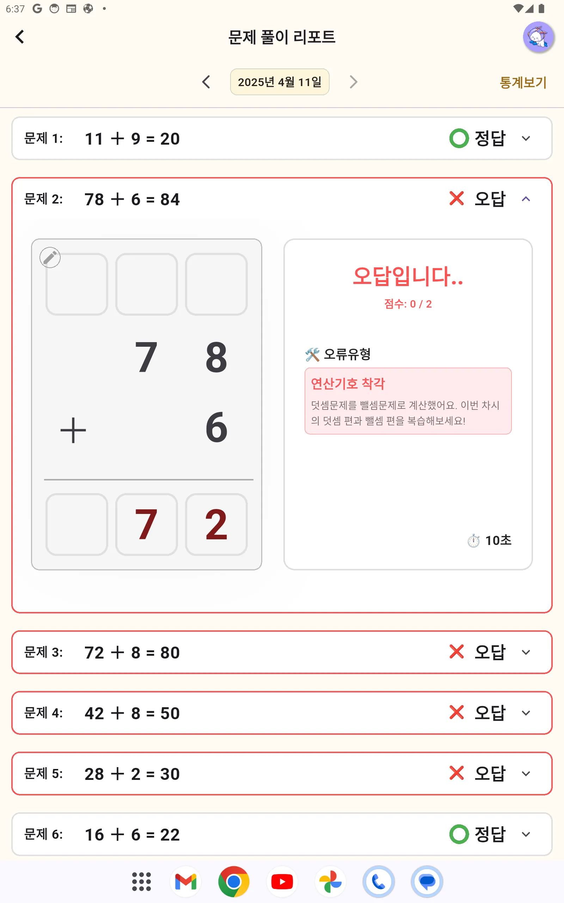| 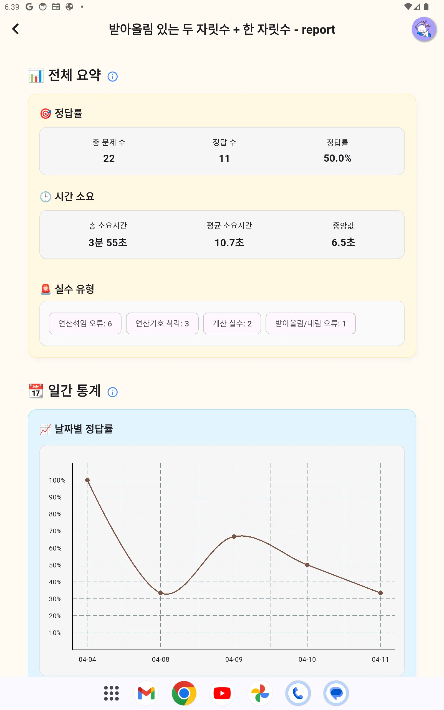

